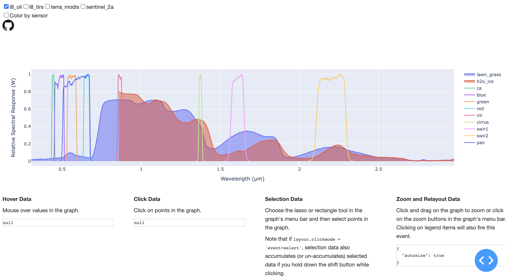
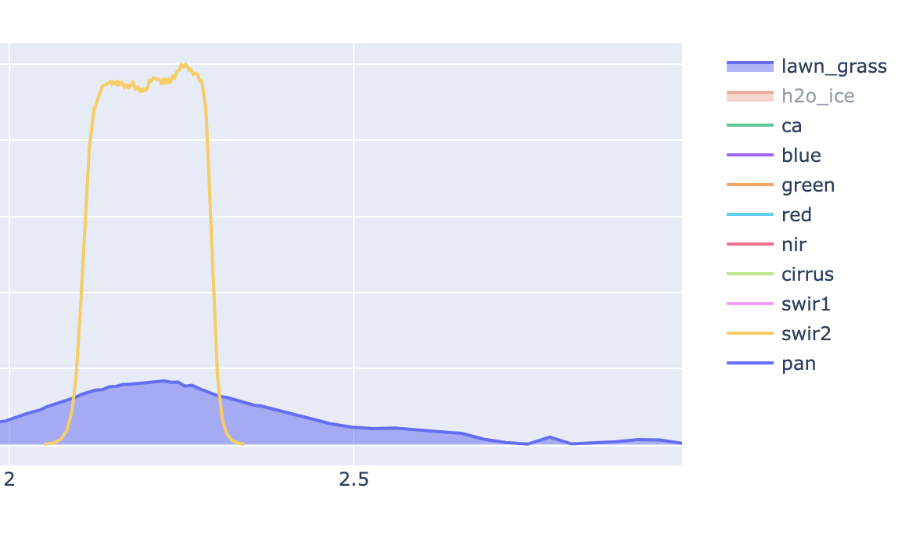
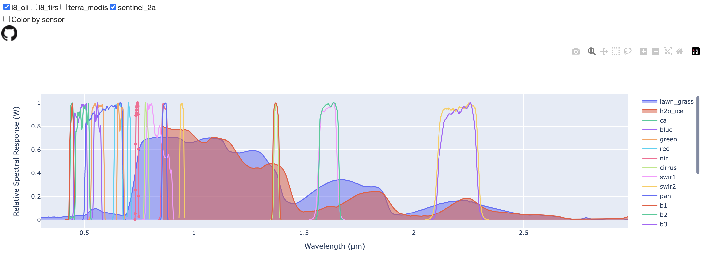
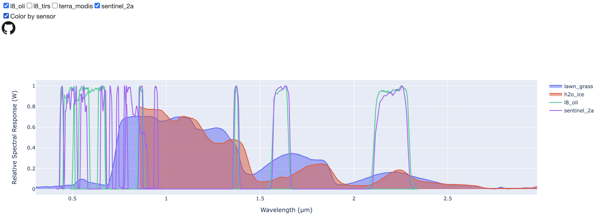
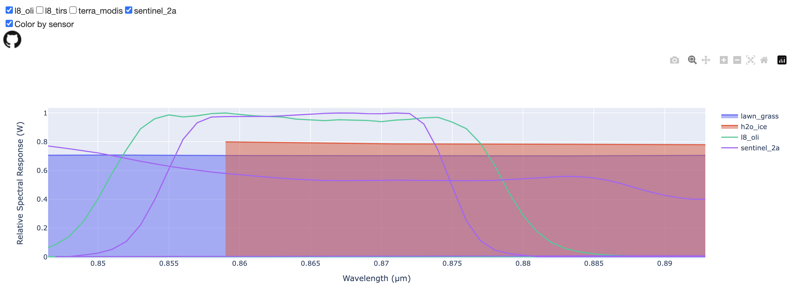

# satellite-rsr
## Purpose
Interactively examine relative spectral response (RSR) curves of spaceborne instruments and ground target reflectances. 

## Methodology
This work is largely based around improving the exiting (and functional) 
[Landsat Spectral Characteristics Viewer](https://landsat.usgs.gov/spectral-characteristics-viewer). Here, the same 
principles are reimplemented using the [Plotly (Dash) library](https://plotly.com/) in Python. This project aims 
to: 
1) make the plotting framework open-source,
2) make it easy for a user/developer to add or remove spectra, and
3) allow for creation of publication-grade figures using a web UI.

## Demo
*The application.* 


*Toggle targets and bands by clicking the legend items.* 


*Add multiple sensors (top menu items) to compare.*

 
*Select 'Color by sensor' to color code by unique sensor, instead of unique band.* 


*Zoom (hourglass icon) to compare targets and bands up close.* 


## Python environment
Requires the following non-standard Python libraries:
- dash
- pandas
- gunicorn *(only required if deploying)*

**For `pip`**: use the [requirements.txt](requirements.txt) file.

**For `conda`**: use the [environment.yml](environment.yml) file: 
```
conda env create -f environment.yml
```
or create using the command line (recommended):
```
conda create --name dash python=3.9.15 
conda install -c conda-forge numpy pandas dash
```

## Usage
### [plot_rsr.py](./plot_rsr.py)
- Script generates the full interface, and calls a local server, which will output its URL in the console. There are 
  some variables hard-coded at the top of the script, but it can be run as-is.

## Input data formats
### Satellite RSRs
- Stored in file [rsr_ALL.csv](./data/rsr_ALL.csv)
- Header: `wavelength_um,rsr_watts,sensor,band`

### Environmental RSRs
- Stored in file [env_spectra_ALL.csv](./data/env_spectra_ALL.csv)
- Header: `wavelength_um,rsr_watts,spectra_type`

## TODOs
- Add more sensors
  - Aqua, ASTER, EO-1 ALI (MODIS): https://mcst.gsfc.nasa.gov/calibration/parameters
  - Sentinel 2b: https://sentinels.copernicus.eu/web/sentinel/user-guides/sentinel-2-msi/document-library/-/asset_publisher/Wk0TKajiISaR/content/sentinel-2a-spectral-responses
  - VIIRS (Suomi NPP): https://ncc.nesdis.noaa.gov/VIIRS/VIIRSSpectralResponseFunctions.php
  - Commercial?
- Add more environmental spectra
  - Minerals
  - Water
  - Snow
  - Cloud/shadow
- Lookup table to prettify display text (e.g., `l8_oli` --> `L8 OLI`)
- Clean up spectra wavelengths (clip to minimum response to avoid long tails, see MODIS band 5 as example.)
- List min/max band for a ground target based on spectral sensor suite.
- Allow toggling of bands when 'Color by sensor' is enabled.

## Data Sources
### Satellite sensors
- Terra MODIS: https://mcst.gsfc.nasa.gov/calibration/parameters
- Landsat 8 OLI/TIRS: https://landsat.usgs.gov/spectral-characteristics-viewer
- Sentinel 2a: Sentinel 2b: https://sentinels.copernicus.eu/web/sentinel/user-guides/sentinel-2-msi/document-library/-/asset_publisher/Wk0TKajiISaR/content/sentinel-2a-spectral-responses

### Ground spectral features
- Landing page: https://crustal.usgs.gov/speclab/QueryAll07a.php
  - Lawn Grass (2228)
  - H2O Ice (1499)

## Dev notes
### Create `environment.yml`
```
conda env export > environment.yml
```

### Deploy locally
1) Start local environment (conda, virtualenv, etc.)
2) Run script `python plot_rsr.py`.
3) Browse to webpage URL listed in console. 

### Deploy to Heroku
This app was previously deployed for free in Heroku, however hosting costs are applied after so many hours of use.   

Follow the [Plotly Deployment Guide](https://dash.plotly.com/deployment). Notes:
1) Initial setup on macos (Apple Silicon, requires `homebrew` and `xcode-select`):
```
arch -x86_64 brew install heroku/brew/heroku
```
2) To setup the Heroku CLI, follow Heroku's [Getting Started With Python](https://devcenter.heroku.com/articles/getting-started-with-python#set-up) 
   guide.
3) Setup [Procfile](Procfile) and add `plot_rsr` script.
4) Setup [requirements.txt](requirements.txt) using `pip` (there's a bug in pip that produces local paths for some 
   libs, so use `list --format=freeze` arguments to get around it):
```
pip list --format=freeze > requirements.txt
```
   - The build failed on `mkl*` dependencies, the solution was to remove them completely.
   - `mkl*` can be avoided completely if `numpy` is installed from `conda-forge`. 
   - The build also failed on `setuptools=x.xx`, the solution was to remove the version requirement. 
5) Setup [runtime.txt](runtime.txt) to define the deployed Python version. Notes:
   - Must be compatible with [Heroku stack version](https://devcenter.heroku.com/articles/python-support#supported-runtimes). 
6) Push to Heroku repo with `git push heroku main` 
    - If working from a local branch that is not `main`, use `git push heroku mybranch:main`

### Deploy from Github repo to Heroku
- Purpose: Heroku will update deployment every time a commit is made to the target branch.
- Should ideally do this after the `Deploy to Heroku` workflow is tested and verified.
- Enable Github deployment 
    - dashboard.heroku.com -> "Deploy" -> "Deployment method" -> "Github"
- Enable automatic deployment
    - dashboard.heroku.com -> "Deploy" -> "App connected to Github" -> Enable automatic deploys from desired branch.

### Licensing
See [LICENSE.md](LICENSE.md).
